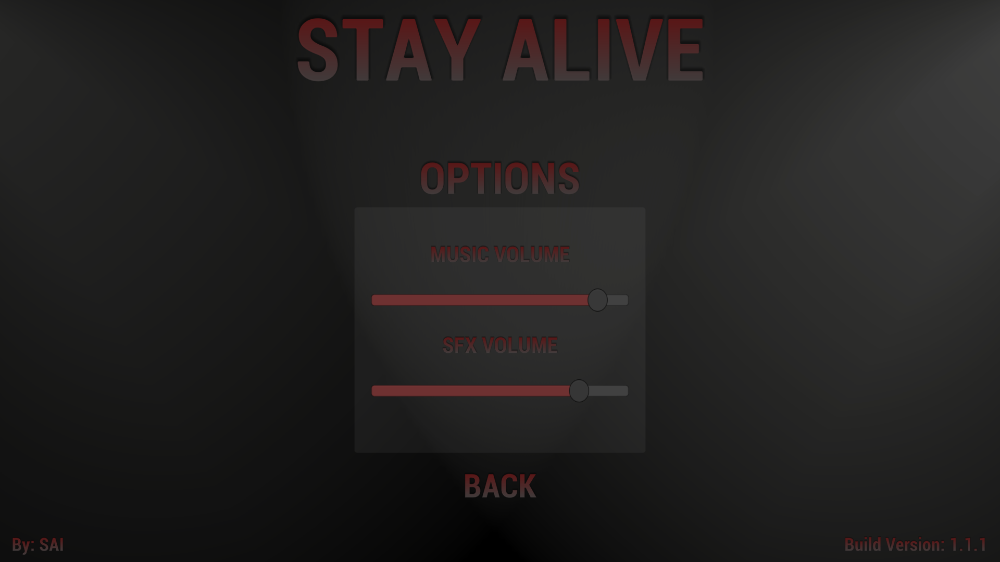

# STAY ALIVE
## Deskripsi
*Game* yang dibuat merupakan *game platformer* 2D dengan tema *survival*. Beberapa aturan dari *game* yang dibuat adalah:
- Pemain akan di-*spawn* di sebuah *map* yang gelap yang penuh dengan *zombie*. 
- Pemain memiliki energi yang terbatas untuk bertahan hidup.
- Energi akan berkurang terus menerus dengan *rate* tertentu hingga habis.
- Untuk melihat jauh, pemain dapat menggunakan senter yang menghabiskan energi.
- Pemain dapat membunuh *zombie* dengan menembakkan peluru. Peluru menggunakan energi.
- Energi pemain dapat bertambah apabila pemain mendekati *recharge station*.
- *Recharge station* di-*spawn* titik-titik tertentu di *map* secara *random*.
- *Zombie* di-*spawn* di titik-titik tertentu di *map* secara *random*.
- *Recharge station* dan *zombie* akan di-*respawn* setiap awal *wave*.
- *Wave* akan berlanjut apabila pemain berhasil membunuh semua *zombie* yang ada di *map*.

Beberapa hal menarik dari game ini di antaranya:
- Konsep *lighting* yang berperan penting memberikan konsep horror.
- Digunakan *shader graph* untuk membuat objek *glowing*.
- Terdapat *audio* yang menyesuaikan dengan keadaan pemain.
- Terdapat dua tipe *zombie*.
- Terdapat dua tipe peluru.
- Semua objek *spawning* menggunakan *pooling*.
- Terdapat 25+ *custom script* yang dibuat sendiri.

## Cara Kerja
Pada pengembangan game ini digunakan *design pattern singleton* yang memudahkan referensi suatu objek dari objek yang lain. 

Semua *art* dari game didapatkan secara gratis dari sumber di Internet. Karakter dianimasikan dengan mengubah-ubah *sprite* secara cepat dan bergantian. Semua animasi dikontrol oleh suatu *state machine* pada `animation controller` dan diatur dari *script*.

Gerakan karakter diatur dengan memanipulasi komponen kecepatan pada `rigidbody` suatu objek tergantung oleh input pengguna. Terdapat juga penambahan gaya untuk memberikan kesan *impact* ketika *zombie* terkena peluru.

Seluruh audio diatur dalam suatu `audio mixer`. *Audio* pada *game* dibedakan menjadi *background music* dan *sfx*. Keduanya memiliki *channel* tersendiri dan bisa diatur pada *options menu* dari game. Agar *audio* terdengar maka diberikan `audio listener` pada objek `camera`. Kemudian diberikan pula `audio source` pada objek yang menimbulkan suara misalnya langkah kaki pemain, suara *zombie*, dan lain-lain. Suara *sfx* menggunakan *spatial blending* sehingga jarak sumber suara dengan pendengar mempengaruhi besar suara. Selain itu, terdapat *audio manager* yang memberikan *background music*. *Audio manager* ini bertugas memutar suara yang tidak menggunakan *spatial blending* seperti suara *theme song*, suara *random noise*, dan lain-lain.

Pada peta diletakkan beberapa *point* untuk penanda tempat untuk *spawn* *zombie* dan *recharge station*. Kemudian semua proses *spawning* diatur oleh *game manager* dengan memilih tempat *spawn* tersebut secara *random*.

Karakter memiliki energi awal 100. Energi ini berkurang seiring berjalannya waktu. Pengurangan ini dilakukan dengan mengurangi energi pada fungsi `Update` sehingga dilakukan berkali-kali. Energi juga dapat berkurang ketika karakter menembak dan ketika diserang *zombie*. Pada *script attack* *zombie*, ketika *zombie* mengenai pemain maka energi pemain akan di-*reference* dan dikurangi dari *script attack* *zombie*.

Peta dibuat menggunakan *tilemap system* yang tersedia dari Unity. Untuk `collider`-nya, digunakan `composite collider` dan `tilemap collider` untuk menggabungkan semua objek dalam peta menjadi satu `collider`.

*Score* pemain disimpan pada *scoreboard online*. Proses penyimpanan dilakukan dengan melakukan *http request* menggunakan `unity web request` dengan *method* yang disesuaikan.

*Main menu* dan *scoreboard* dibuat pada `scene` terpisah dari *main game*. Pada *main menu* terdapat *options* untuk mengatur suara dan akan disimpan pada `playerprefs`. Pada *scoreboard* akan ditampilkan data 5 pemain dengan score tertinggi dari *scoreboard online*.

*Script zombie* dibuat berparameter dan dapat diatur pada *inspector* di Unity untuk memundahkan pembuatan 2 tipe *zombie*. Contoh parameter yang di-*expose* adalah *damage*, kecepatan gerak, *attack rate*, *look radius*. *Zombie* dapat mengejar pemain ketika jaraknya kurang dari *look radius*.

Peluru tembakan pemain juga terdapat dua jenis. Hal ini dilakukan dengan cara yang sama dengan *zombie*, yaitu mengubah *damage* dari peluru. Selain itu kedua jenis peluru juga memiliki perbedaan warna, perbedaan volume suara, dan perbedaan cara men-*trigger*. Peluru biasa dapat ditembakkan dengan menekan tombol tembak sebentar, sedangkan peluru yang lain ditembakkan dengan menahan tombol tembak selama satu detik lalu melepaskannya.

Semua objek yang di-*spawn* berulang-ulang disimpan dalam sebuah pool dan akan di-*reuse*. Terdapat satu buah objek *pooler* yang bertugas meng-*instantiate* semua objek yang dibutuhkan di awal. Selanjutnya ketika suatu *script* butuh meng-*instantiate* suatu objek, ia hanya perlu memintanya dari *pooler*.

Kebanyakan *script* terutama yang membutuhkan animasi memerlukan sebuah *method* yang dapat di-*trigger* setelah sekian detik, atau berulang setiap waktu tertentu. Hal tersebut dilakukan dengan menggunakan `coroutine` dan `invoke function`.

## *Library*
*Asset* gambar 2D dan audio yang digunakan adalah sebagai berikut:
- **THE ZOMBIES - FREE SPRITES** - https://www.gameart2d.com/the-zombies-free-sprites.html
- **THE ROBOT - FREE SPRITE** - https://www.gameart2d.com/the-robot---free-sprites.html
- **FREE GRAVEYARD PLATFORMER TILESET** - https://www.gameart2d.com/free-graveyard-platformer-tileset.html
- **Footstep(Snow and Grass)** - https://assetstore.unity.com/packages/audio/sound-fx/footstep-snow-and-grass-90678
- **Futuristic Gun SoundFX** - https://assetstore.unity.com/packages/audio/sound-fx/weapons/futuristic-gun-soundfx-100851
- **Grenade Sound FX** - https://assetstore.unity.com/packages/audio/sound-fx/grenade-sound-fx-147490
- **Horror Elements** - https://assetstore.unity.com/packages/audio/sound-fx/horror-elements-112021
- **Zombie Sound Pack - Free Version** - https://assetstore.unity.com/packages/audio/sound-fx/zombie-sound-pack-free-version-124430

Untuk *library* yang digunakan di antaranya adalah:
- **Universal Rendering Pipeline**, digunakan untuk membuat *custom shader* dan memberikan *post-processing* pada aplikasi untuk memberikan efek tambahan seperti *blooming* dan *glowing*.
- **Cinemachine**, digunakan untuk mempermudah mengatur kamera kontrol.
- **TextMeshPro**, digunakan untuk memberikan hasil UI *text* yang lebih baik dibandingkan UI *text* standar dari Unity dan melakukan kustomisasi.

## *Screenshot Game*
### *Main Menu*

### *Options Menu*

### *Score Board*

### *Gameplay*

### *Game Over*

## *Credits*

Steve Andreas Immanuel

13517039

2020
